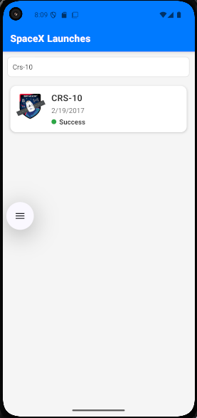
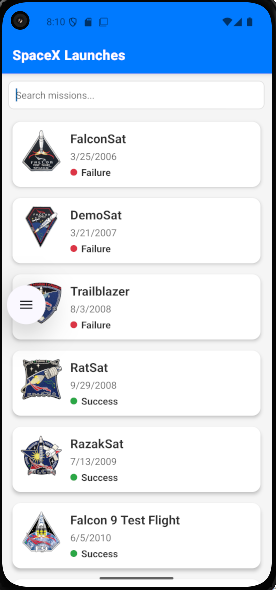
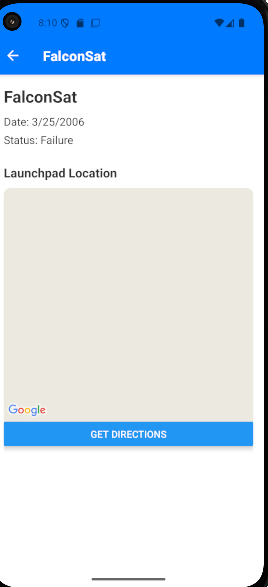

# 🚀 SpaceX Launch Explorer

A mobile application built with **React Native** and **Expo** that allows users to explore a list of past SpaceX rocket launches.  
The app features infinite scrolling, a search bar, and a detailed view for each launch, including a map of the launchpad location.

---

## ✨ Features
- **Infinite Scrolling**: Automatically loads more launches as you scroll to the end of the list.
- **Search Functionality**: Filter launches by mission name.
- **Pull-to-Refresh**: Refresh the list to fetch the latest data.
- **Launch Details**: View comprehensive details for each mission.
- **Interactive Map**: See the exact location of the launchpad on a map.
- **Native Maps Integration**: Get directions to the launchpad using your device's native map application.

---

## 🛠 Prerequisites
- **Node.js** (v18 or higher)  
- **Expo CLI** (`npm install -g expo-cli`) or use `npx`

---

## ⚡ Installation

Clone this repository:

```bash
git clone https://github.com/your-username/tripare.git
cd tripare
```

Install dependencies:

```bash
npm install
```

This will install all required packages including `react-native-maps`, `expo-location`, and `axios`.

---

## ▶️ Running the App

Start the Expo development server:

```bash
yarn android
```

- Scan the QR code with the **Expo Go** app on your mobile device (iOS/Android)  
- Or run it on a simulator/emulator.

---

## 📂 Project Structure
```
├── App.tsx
├── app.json
├── package.json
├── README.md
├── src
│   ├── api
│   │   ├── spacexApi.ts
│   │   └── types.ts
│   ├── components
│   │   ├── common
│   │   │   ├── AppText.tsx
│   │   │   └── ErrorState.tsx
│   │   ├── LaunchCard.tsx
│   │   └── LaunchpadMap.tsx
│   ├── navigation
│   │   └── AppNavigator.tsx
│   └── screens
│       ├── LaunchDetailsScreen.tsx
│       └── LaunchesListScreen.tsx
```

---

## 🌍 Map Implementation & Permissions

The app uses **react-native-maps** to display the launchpad location.  
The `LaunchpadMap.tsx` component handles the core logic.

### Libraries Used
- `react-native-maps` – Google Maps (Android) & Apple Maps (iOS)  
- `expo-location` – Access device location  

### Permission Flow
1. When `LaunchDetailsScreen` loads, `LaunchpadMap` requests location permission.  
2. If denied → shows error message.  
3. If granted → fetches user’s coordinates.  
4. `MapView` displays:
   - A marker for the launchpad  
   - A marker for the user’s location  
5. **Get Directions** button opens the device’s native maps app with launchpad location pre-filled.  

---

## 📱 App Screenshots

| Launch Search | Launch List | Launch Details |
|---------------|-------------|----------------|
|  |  |  |

---
